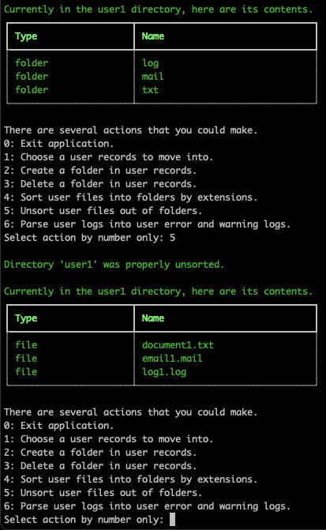

# File Automation

### Author:
Jacob Bassett

### Date: 
11/16/2023

### Description:
This is a small records management commandline interface for the management of user records. It is not an exhaustive/complete application but does perform quite a few file operations.

### Testing
Run `pytest` in the terminal to test individual functions.

### Tools
iniconfig==2.0.0
markdown-it-py==3.0.0
mdurl==0.1.2
packaging==23.2
pluggy==1.3.0
Pygments==2.16.1
pytest==7.4.3
rich==13.7.0

### Usage:
***In the terminal run `python automation/main.py` to start the application.***

***Navigate to the 'global' directory by typing `1` in the commandline.***

***Leave the application by typing `0` in the commandline when prompted.***

***Entire a user's records by typing '1' in the commandline followed by a specification of the user.***

***Delete a user's records by typing '2' in the commandline while in the 'global' directory followed by a specification of the user.***

***Restore a user's records by typing '3' in the commandline while in the 'global' directory followed by a specification of the user.***

***With a user's records, type '2' to create a new folder. You will be prompted for a file name.***

***With a user's records, type '3' to delete folder. You will be prompted for a file name.***

***With a user's records, type '4' to sort files into folders based on file extensions.***

***With a user's records, type '5' to unsort files out of folders.***

***With a user's records, type '6' to parse log file into new error and warning log files.***

